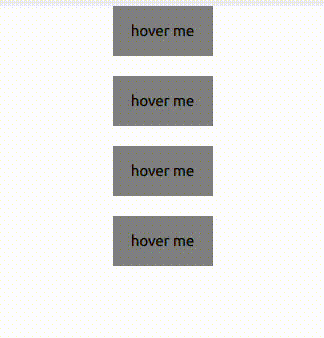

### Custom qml tooltip enspired by discord


### installation:
- create a fork
- clone 
- install python poetry if you havent already
- cd into the cloned repo
- run: 
```console
poetry install    
poetry run python -m example.py      
```